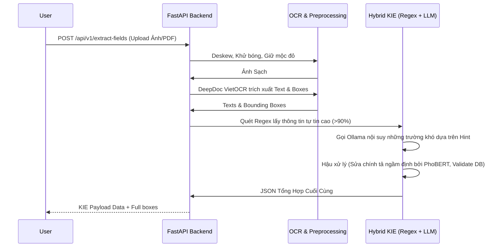

# VN-Digitize-AI 

**VN-Digitize-AI** là hệ thống AI số hoá tài liệu hành chính và pháp lý tiếng Việt. Hệ thống cung cấp toàn bộ pipeline xử lý từ lúc nạp đầu vào (ảnh chụp/scan vật lý) đến đầu ra nguyên vẹn dữ liệu có cấu trúc JSON và file PDF 2 lớp có khả năng tìm kiếm (Searchable PDF).

Mục tiêu cốt lõi của dự án là loại bỏ quy trình nhập liệu thủ công, tự động đọc hiểu và bóc tách dữ liệu từ văn bản với độ chính xác cao nhờ sự kết hợp giữa Rule-based (Regex) và mô hình ngôn ngữ lớn (Local LLM), đồng thời đảm bảo bảo mật dữ liệu tuyệt đối (100% On-Premise).

---

##  Các Tính Năng Nổi Bật

1. **OCR & KIE Thông Minh (Hybrid Extraction):**
   - Sự kết hợp giữa DeepDoc VietOCR và kiến trúc "Hybrid KIE" đa tầng (Regex + Ollama LLM + Merge Logic) giúp bóc tách 5 trường thông tin chuẩn xác: `loai_van_ban`, `so_van_ban`, `ngay_ban_hanh`, `co_quan_ban_hanh`, và `trich_yeu`.
   - **Template Động:** Hỗ trợ chủ động khai báo các bộ mẫu (template) KIE tuỳ chỉnh cho từng loại nghiệp vụ.
2. **Tiền Xử Lý Ảnh Nâng Cao (Advanced Image Preprocessing):**
   - Làm phẳng (Deskew), cắt lề tự động (Auto-crop), khử bóng (Shadow Removal).
   - Tẩy ố vàng và **giữ nguyên mốc con dấu đỏ** (Red Stamp Preservation).
3. **Phân Tích Hậu Kỳ & Nhận Diện Đối Tượng (Post-processing):**
   - Xác định chữ ký (YOLOv8) và con dấu đỏ (Stamp2Vec).
   - Nhận diện và bóc tách bảng biểu (Table Extraction) thành dữ liệu JSON.
   - Sửa lỗi chính tả bằng AI với mô hình PhoBERT (NLP Correction).
4. **Xử Lý Tác Vụ Bất Đồng Bộ (Asynchronous Processing):**
   - Kiến trúc hàng đợi với Celery và Redis giúp hệ thống không bị block khi xử lý các bộ tài liệu (bundle) lên đến hàng trăm trang.
5. **Auto Summary & Document Splitting:**
   - LLM hỗ trợ tự động tóm tắt nội dung tài liệu dài.
   - Chia tách tự động (Split) bộ tài liệu lớn gồm nhiều văn kiện khác nhau thành các file thành phần bằng cách phân tích cấu trúc ngôn ngữ chữ/trang.

---

## TechStack

| Thành phần | Công nghệ / Framework | Ghi chú |
| :--- | :--- | :--- |
| **Backend API** | FastAPI, Uvicorn | Xây dựng RESTful API tốc độ cao |
| **Task Queue** | Celery, Redis | Xử lý file nặng chạy ngầm bất đồng bộ |
| **OCR Engine** | DeepDoc VietOCR | Mô hình `vgg_transformer` nội bộ siêu chuẩn VN |
| **Computer Vision**| OpenCV, YOLOv8, Stamp2Vec | Xử lý ảnh, tìm chữ ký và mộc đỏ |
| **LLM / AI** | Ollama, PhoBERT | Bóc tách KIE Fallback, tóm tắt, sửa chính tả |
| **Data Validation**| Pydantic | Xác thực đầu vào/đầu ra nghiêm ngặt |
| **PDF Tools** | PyMuPDF (fitz) | IO PDF, tạo file PDF 2 lớp search được |
| **Khác** | TinyDB, Pyzbar | Database cho Feedback vòng lặp, Đọc mã vạch |

---

## Hướng Dẫn Cài Đặt (Local Environment)

### 1. Yêu cầu hệ thống
- **OS:** Windows / Linux / macOS
- **Phần cứng:** Tối thiểu 8GB RAM (Khuyến cáo 16GB), Có GPU (NVIDIA CUDA) là một lợi thế lớn.
- **Môi trường:** Python 3.10+
- **Phần mềm bên thứ 3:** Tesseract OCR 5.x (Cài kèm ngôn ngữ `vie`), Redis Server (dùng qua Docker / WSL / Memurai trên Windows), Ollama (cài đặt [tại đây](https://ollama.ai/download)).

### 2. Cài đặt chi tiết

**Bước 1: Khởi động Ollama và Pull Model KIE Fallback mặc định:**
```powershell
ollama pull qwen2.5:3b-instruct
# Kiểm tra model
ollama list
```

**Bước 2: Cài đặt Dependencies Python:**
```powershell
# Tạo và kích hoạt môi trường ảo (Virtual Environment)
python -m venv .venv
.venv\Scripts\activate      # Trên Windows

# Cài đặt thư viện yêu cầu
pip install -r requirements.txt
```

**Bước 3: Khởi chạy dự án:**

Mở 2 cửa sổ Terminal để chạy song song API Server và Celery Worker (đảm bảo Redis đã chạy ở port 6379):

*Terminal 1 (Chạy FastAPI):*
```powershell
.venv\Scripts\activate
uvicorn app.main:app --reload --host 0.0.0.0 --port 8000
```

*Terminal 2 (Chạy Celery Worker):*
```powershell
.venv\Scripts\activate
celery -A app.celery_app worker --loglevel=info -P solo  # Thêm `-P solo` trên Windows
```

---

## Luồng End-to-End Tiêu Biểu (Document AI Pipeline)



---

## Cấu Trúc Dự Án Nội Bộ

```text
OCR/
├── app/
│   ├── main.py                     # Entry point (16 API Endpoints)
│   ├── celery_app.py               # Background task init (Celery + Redis)
│   ├── schemas.py                  # Pydantic schemas chung
│   └── services/                   # Business Logic Layer
│       ├── ocr.py                  # DeepDoc VietOCR service
│       ├── kie_extractor.py        # KIE đa tầng Pipeline
│       ├── preprocessing.py        # CV2 Pipeline làm sạch ảnh
│       ├── postprocessing.py       # Nhận diện Stamp, Signature, Table
│       ├── nlp_correction.py       # Giao tiếp PhoBERT chữa lỗi
│       └── ...
├── deepdoc_vietocr/                # Module DeepDoc chuẩn (Core AI phụ trợ)
├── docs/                           # Tài liệu thiết kế hệ thống chi tiết
├── data/                           # Thư mục runtime lưu temp file, exported, feedback.json
├── test_kie.py                     # Demo Sandbox cho KIE tích hợp
└── requirements.txt
```

---

## Trọn Bộ Tài Liệu Hệ Thống

Để có cái nhìn sâu sát hơn về thiết kế kĩ thuật, thuật toán và luồng Use-case, vui lòng tham khảo trọn bộ tài liệu tại thư mục `docs/`:
1. [`01_Project_Overview_and_Setup.md`](docs/01_Project_Overview_and_Setup.md) - Tổng quan và Setup.
2. [`02_Business_and_Flows.md`](docs/02_Business_and_Flows.md) - Tài liệu nghiệp vụ phân rã KIE & Phân loại trang.
3. [`03_API_Reference.md`](docs/03_API_Reference.md) - Danh mục tổng quan 16 Endpoint của hệ thống.
4. [`04_AI_Architecture_and_Models.md`](docs/04_AI_Architecture_and_Models.md) - Đặc tả mô hình AI (YOLO, Stamp2Vec, PhoBERT, DeepDoc).
5. [`05_Handover_Credentials_and_Operations.md`](docs/05_Handover_Credentials_and_Operations.md) - Quy trình Operation CI/CD và vận hành.
6. [`project_documentation.md`](docs/project_documentation.md) - Tài liệu đặc tả Use-cases ngắn gọn.
