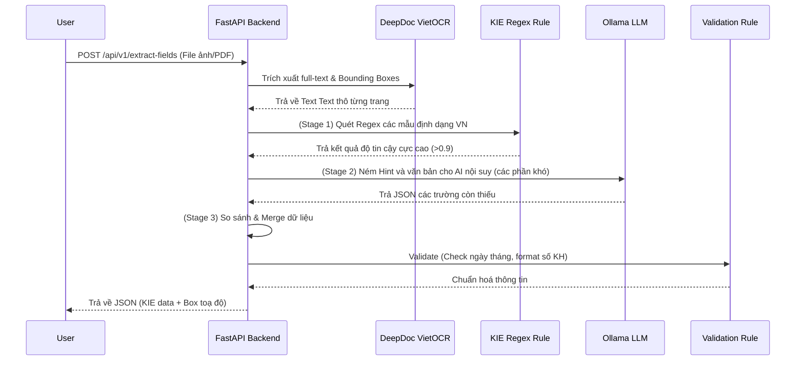

# Tài Liệu Đặc Tả Nghiệp Vụ và Kỹ Thuật - VN-Digitize-AI

Dự án **VN-Digitize-AI** là hệ thống AI số hoá tài liệu chuẩn production, được thiết kế chuyên biệt để xử lý các loại văn bản hành chính, văn bản pháp lý và giấy tờ tiếng Việt. 

Hệ thống kết hợp nhiều module (Pipeline) từ xử lý ảnh, nhận dạng ký tự (OCR), bóc tách thông tin (KIE), cho đến mô hình ngôn ngữ lớn (LLM) để hiểu và tóm tắt văn bản.

---

## 1. Nghiệp Vụ Của Dự Án

Các luồng nghiệp vụ cốt lõi mà dự án giải quyết bao gồm:

1. **Số hoá vật lý (Digitization & Capture):**
   - Hỗ trợ kết nối trực tiếp với máy scan hoặc nhận file upload (ảnh/PDF).
   - Nhận diện mã vạch (Barcode) để tự động phân tách các tệp tài liệu lớn thành từng lô riêng biệt (Bundle splitter).

2. **Tiền xử lý ảnh (Image Preprocessing):**
   - Làm sạch ảnh scan hoặc ảnh chụp bằng điện thoại.
   - **Các bước:** Xoay phẳng (deskew), cắt viền (auto-crop), xoá bóng nhiễu (shadow removal), tẩy ố vàng, nhị phân hoá (binarize) và đặc biệt **giữ lại mộc đỏ (Red Stamp Preservation)**.
   - Lọc bỏ các trang trắng trống.

3. **Nhận dạng ký tự quang học (OCR):**
   - Đọc và trích xuất toàn bộ văn bản (Full-text extract).
   - Bảo toàn cấu trúc theo dòng (Line bounding boxes) phục vụ cho giao diện hiển thị (UI highlighting).

4. **Trích xuất thông tin nghiệp vụ (Key Information Extraction - KIE):**
   - Tự động đọc hiểu và bóc tách dữ liệu có cấu trúc từ văn bản thô. 
   - 5 trường mặc định của văn bản hành chính: `loai_van_ban`, `so_van_ban`, `ngay_ban_hanh`, `co_quan_ban_hanh`, và `trich_yeu`.
   - **Template KIE Động:** Hỗ trợ bóc tách các trường động (mã số thuế, tên bị cáo,...) tùy theo nhu cầu lĩnh vực.

5. **Phân tích Hậu kỳ & Chữ ký (Post-processing):**
   - Quét tìm và nhận diện chữ ký trên trang.
   - Nhận diện và khoanh vùng vị trí con dấu đỏ (Stamps).
   - Bóc tách cấu trúc bảng biểu (Table Extraction).
   - Tự động sửa lỗi chính tả bằng AI (NLP PhoBERT).

6. **Phân loại & Cấu trúc tài liệu (Classification & Splitting):**
   - Chia tách tự động một file PDF dài thành nhiều "Công văn/Quyết định" con bên trong dựa trên việc nhận cấu trúc ngôn ngữ và ngữ mục trang.

7. **Học liên tục (Human-in-the-Loop / Feedback):**
   - Cho phép người dùng hoặc bộ phận QA gửi phản hồi (Feedback) khi AI bóc tách sai. Dữ liệu này được lưu lại phục vụ huấn luyện gia tăng (Incremental Learning).

---

## 2. Công Nghệ Sử Dụng

Dự án áp dụng các công nghệ hiện đại, kết hợp giữa truyền thống và Generative AI:

* **Backend & Tác vụ bất đồng bộ:**
  * **FastAPI:** Framework web hiệu năng cao cho việc xây dựng RESTful APIs.
  * **Celery & Redis:** Kiến trúc xử lý tác vụ ngầm (Background Task Queue) giúp các file nặng không block hệ thống (Async workers).
* **Engine Nhận diện (OCR & KIE):**
  * **Tesseract OCR:** Phân tích bố cục (Layout Analysis).
  * **DeepDoc VietOCR:** Sử dụng kiến trúc `vgg_transformer` xử lý và đọc tiếng Việt chính xác nhất.
  * **Ollama (Local LLM):** Chạy cục bộ các mô hình LLM (như `qwen2.5:3b-instruct`) để tóm tắt văn bản và hỗ trợ nội suy phân tích KIE (Fallback) đảm bảo bảo mật dữ liệu tuyệt đối (không gọi API ra ngoài).
* **AI & Computer Vision (Thị giác máy tính):**
  * **OpenCV / NumPy:** Tiền xử lý ảnh (xoay nền, đổi màu).
  * **YOLO (Hugging Face `tech4humans/yolov8s-signature-detector`):** Mô hình Object Detection để quét chữ ký.
  * **Stamp2Vec (mô hình YOLO-stamp):** Phát hiện và bóc tách con dấu đỏ.
* **NLP (Xử lý Ngôn ngữ Tự nhiên):**
  * **PhoBERT:** Mô hình ngôn ngữ chuyên biệt cho Tiếng Việt để chữa lỗi từ vựng/chính tả mạn tính của OCR (NLP Correction).
* **Khác:**
  * **Pydantic:** Xác thực dữ liệu và Schema đầu vào/ra nghiêm ngặt (Data validation).
  * `pdfplumber`, `PyMuPDF`: Xử lý I/O luồng PDF.

---

## 3. Luồng Hoạt Động (Workflows)

### Flow 1: Luồng End-to-End Trích xuấn dữ liệu (OCR -> KIE)



### Flow 2: Luồng Tiền xử lý ảnh & Nhận diện Mộc Đỏ
```mermaid
graph TD
    A[Ảnh đầu vào (Upload / Camera)] --> B{Kiểm tra}
    B -->|Bị lệch| C[Deskew (Chỉnh nghiêng)]
    B -->|Viền dư thừa| D[Auto-crop (Cắt tự động)]
    B -->|Bóng / Ủ vàng| E[Shadow & Stain Removal]
    C --> F[Binarization]
    D --> F
    E --> F
    F --> G{Preserve Red Stamp?}
    G -->|Yes| H[Lọc layer màu đỏ & Mask riêng]
    G -->|No| I[Gaussian Binarize Thường]
    H --> J[Output Ảnh Sạch]
    I --> J
```

### Flow 3: Luồng Xử lý Queue Bất đồng bộ (Async)
```mermaid
graph LR
    A[Frontend] -->|Submit Document > 50 trang| B(POST /api/v1/async/ocr-kie)
    B --> C[Redis / Broker]
    C --> D[Celery Worker 1]
    C --> E[Celery Worker 2]
    D --> F{Task Xong}
    E --> F
    F --> G[Lưu DB / File Export]
    A -->|Polling (GET /task/{id})| H[Lấy kết quả KIE]
```

---

## 4. Tài Liệu API Chi Tiết (API Documentation)

### 4.1. Nhóm API Thu Thập & Tiền Xử Lý (Ingestion & Preprocessing)

*   **`POST /api/v1/scan-upload`**
    *   **Nghiệp vụ:** Upload file hoặc trigger máy quét vật lý. Tự động tìm dải mã vạch (Barcode) trong các trang giấy và tiến hành chia mẻ (split bundles).
    *   **Input:** Multi-part file uploads (ảnh, PDF), Mode `scanner` hoặc `upload`, DPI...
    *   **Output:** Danh sách các files đã phân luồng lô `ScanUploadResponse`.

*   **`POST /api/v1/preprocessing` / `POST /api/v1/upload-preprocess`**
    *   **Nghiệp vụ:** Làm sạch tài liệu trước khi gửi cho nền tảng OCR. Cực kì quan trọng để giảm lỗi nhận diện chữ.
    *   **Tuỳ chọn:** `deskew`, `auto_crop`, `shadow_removal`, `denoise`, `preserve_red_stamp`.

### 4.2. Nhóm API OCR & KIE (Xử lý Văn Bản Trọng Tâm)

*   **`POST /api/v1/ocr-fulltext`**
    *   **Nghiệp vụ:** Nhận lại toàn bộ chữ có trên ảnh, không bóc tách trường thông tin.
    *   **Output:** Array of lines, bouding boxes và độ tự tin (Confidence score), text liền mạch.

*   **`POST /api/v1/kie`**
    *   **Nghiệp vụ:** Dành cho đầu vào Dạng TEXT THÔ. Trả về cấu trúc KIE ngay lập tức (Regex + LLM). 
    *   **Tính năng:** Nhận parameter `template` `custom_fields` để nhặt ra bất kỳ trường ngoại lai nào.

*   **`POST /api/v1/ocr-kie`**
    *   **Nghiệp vụ:** Pipeline All-in-One (Ảnh đập vào -> KIE đẻ ra). Trả chi tiết cấp độ cả từng trang (Ai, Chữ nào) lẫn Document (Tổng hợp sau cùng).

*   **`POST /api/v1/extract-fields`**
    *   **Nghiệp vụ:** Cấp cao nhất cho Business Logic. (Ảnh đập vào -> KIE -> Logic Validate).
    *   **Ví dụ:** Kiểm tra xem ngày ban hành trên công văn có hợp lệ không, logic liên kết mã hiệu và cơ quan cấp có đúng luật văn bản Bộ Nội Vụ không.

### 4.3. Nhóm API Phân loại và Hỗ trợ (Classification & Utilities)

*   **`POST /api/v1/split-document`**
    *   **Nghiệp vụ:** Ném vào 1 file PDF scan 100 trang lẫn lộn 5 Quyết định khác nhau. Chức năng sẽ đọc, đánh giá ngữ nghĩa và **cắt nó thành 5 Document riêng rẽ**.

*   **`POST /api/v1/auto-summary` & `/ocr-auto-summary`**
    *   **Nghiệp vụ:** Tóm tắt tự động ý chính văn kiện do sếp/lãnh đạo không có thời gian đọc nguyên văn trang giấy 20 mặt. Sử dụng LLM Ollama cục bộ độc lập.

*   **`POST /api/v1/postprocess-check`**
    *   **Nghiệp vụ:** Bắn ảnh lên để AI quét xem tài liệu đó CÓ KÝ CHƯA (vị trí chữ ký), ĐÓNG DẤU CHƯA (Red Stamp YOLO) và có BẢNG không (Table Extractor).

*   **`POST /api/v1/nlp-correct`**
    *   **Nghiệp vụ:** Gửi câu "Uy đinh về quản lý tài chin" -> PhoBERT tự nhận sai và trả về "Quy định về quản lý tài chính".

### 4.4. Nhóm API Async & Hệ Thống (Async Task Celery)

*   **`POST /api/v1/async/ocr-kie`** & **`POST /api/v1/async/split-document`**
    *   **Nghiệp vụ:** Giống hệt API chính nhưng thay vì mất 10 phút chờ, HTTP Request trả về ngay lập tức một `task_id` (Non-blocking).
*   **`GET /api/v1/task/{task_id}`** 
    *   **Nghiệp vụ:** Frontend dùng polling vào để lấy % tiến độ (Progress) của Request trên và kết cục xử lý SUCCESS/FAILED.

### 4.5. Nhóm Output & Feedback Loop

*   **`POST /api/v1/export-pdf-searchable`**
    *   **Nghiệp vụ:** Đóng gói ảnh đã làm sạch và Toạ độ OCR (Hộp chữ) để Build ra 1 file PDF 2 lớp. Trang 1 là hình để người dùng đọc, ẩn dưới bề mặt là text có thể copy/paste/bôi đen tìmm kiếm được.
*   **`POST /api/v1/feedback`**
    *   **Nghiệp vụ:** Nhân viên thư ký phát hiện OCR đọc sai số văn bản -> Gửi request cập nhật đính chính trên UI. Server lưu lại nguyên văn lỗi và chữ trúng làm Dataset phục vụ RAG/Fine-tuning cho các thế hệ model tới.
